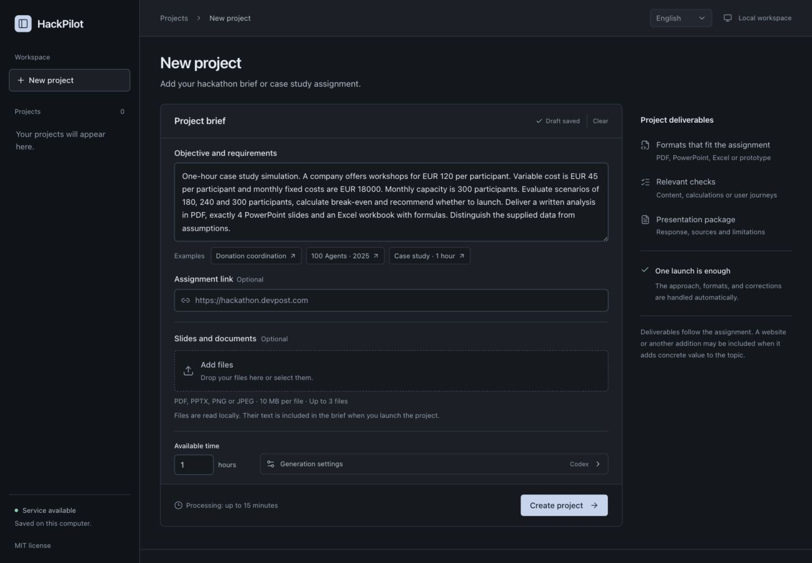

# HackPilot

**v0.0.6** · first project using Astra :)

**Turn hackathon briefs and case studies into deliverables you can inspect, test, and export.**

HackPilot is a local workspace that reads an assignment, chooses an approach, produces the relevant files, checks them, and attempts corrections. It supports reports, slide decks, spreadsheets, and interactive web prototypes, with an English / French interface.

[Get started](#quick-start) · [User guide](docs/USER_GUIDE.md) · [Contributing](CONTRIBUTING.md) · [MIT license](LICENSE)



_English interface. Switch between English and French from the top bar._

## What it does

- **Read the assignment.** Paste a brief, provide a public event URL, or import PDF, PowerPoint, and image files. Review extracted text and page references before starting.
- **Choose useful deliverables.** Required formats take priority. HackPilot can propose a website, simulator, or another addition when it helps answer the assignment and fits the available time.
- **Produce editable files.** Download reports, PowerPoint decks, Excel models with formulas, and web prototype source code.
- **Build from a shared reference.** Compare alternatives, trace facts to source quotations, label assumptions, evaluate common calculations, define executable input-change checks for spreadsheets, and define acceptance criteria before production. A separate capability review checks that the criteria can be met by the supported formats.
- **Check and correct.** Save and test each deliverable separately, then review the complete response against its criteria and cross-check consistency. Corrections target the affected deliverables; up to two repair rounds are available.
- **Pick up where you left off.** Your brief and settings are saved in the browser. Reloading also restores the open project, selected tab, and source file without restarting generation. Search previous projects and open completed work directly on its results.
- **Keep the work inspectable.** Follow the current step and elapsed time, read the execution log, sources, and limitations, stop a run, resume interrupted work, and export the project as a ZIP.

## Quick start

Requires **Node.js 22.13+**, npm, and a Codex login for generation. HackPilot installs its own Codex CLI dependency; it does not change a global installation.

```sh
git clone https://github.com/HKASAR1239/hackpilot.git
cd hackpilot
npm ci
npx playwright install chromium
npm run login
npm run build
npm start
```

Open **[localhost:4317](http://127.0.0.1:4317)**. Skip `npm run login` if Codex is already authenticated on your machine. On Linux, browser system dependencies may also be needed: `npx playwright install --with-deps chromium`.

Choose **English** in the top bar, add your assignment and any documents, set the available time, then select **Create project**. The language choice is saved in your browser and used for new generated projects. Your assignment draft is saved as you edit; **Clear** removes it, with an **Undo** option.

### Try it without a model call

Skip the login step and choose **Donation coordination** in the examples. This selects a fixed French demo that exercises file creation, browser checks, persistence, and ZIP export. It does not generate a response to an arbitrary brief, and it is never used as a silent fallback when generation fails.

For a real case study, choose **Case study · 1 hour**. It requests a profitability analysis, exactly four slides, and an Excel model. Creating that project uses your Codex account.

## Outputs

| Deliverable                | Files                                             | Checks                                                              |
| -------------------------- | ------------------------------------------------- | ------------------------------------------------------------------- |
| Analysis or recommendation | PDF and editable Markdown                         | Saved content, non-empty PDF pages, model review                    |
| Presentation               | Editable PowerPoint, PDF, Markdown notes          | Requested slide count, file structure, PDF pages, text density      |
| Calculation model          | Excel with formulas, CSV values, Markdown summary | Independent formula evaluation, references, cycles, stored results  |
| Web prototype              | HTML, CSS, JavaScript, README                     | Playwright scenarios, persistence, mobile layout, JavaScript errors |

A project can combine these formats. A website is selected when the assignment requires it or it contributes something useful; the plan explains the choice. Explicit restrictions remain part of the decision.

## How a run works

```text
Assignment → Sources → Plan → Shared reference → Saved deliverables → Review & repairs → Export
```

1. Read the brief, uploaded documents, and available public rules or resource pages.
2. Identify required outputs and constraints. Use a focused approach for a case study, or compare up to three concepts when the topic leaves room for a choice.
3. Challenge the approach and create a shared reference: supported facts, assumptions, independently evaluated calculations, failure modes, and criteria linked to requirements.
4. Produce and check one deliverable at a time. Prepare calculation models before the reports and slides that use them. Save each checked result so an interruption does not discard it.
5. Review the complete set against every acceptance criterion. Record evidence, identify inconsistencies, and repair affected deliverables. Unresolved required checks prevent completion.
6. Export files, sources, reference, review, execution diagnostics, and remaining limitations.

The **available time** field helps scope the project. A generation attempt has its own two-hour limit. One project runs at a time; interrupted projects remain on disk and can be resumed within their remaining budgets.

## Local storage and generation

Projects are stored in `.hackpilot/`, which is excluded from Git. The current assignment draft, including extracted document text, is also saved in browser local storage until you clear it or remove site data. Document extraction and OCR run locally. During Codex generation, the brief, extracted source text, and content being generated or reviewed are sent through your configured Codex connection. Your account's usage limits apply.

Generation uses the model configured in Codex, with **`xhigh` for strategy and review** and **`high` for deliverable production and repairs**. Set `HACKPILOT_MODEL`, `HACKPILOT_REASONING_EFFORT`, and `HACKPILOT_PRODUCTION_EFFORT` to override these choices. The selected model must support the requested effort. Each attempt records its requested settings in the activity log; existing results are not regenerated automatically.

The app binds to loopback. Generated web previews use a separate local port and a content policy that blocks external connections. Generated programs are not run as shell commands; document exports are rendered from validated structured data.

See the [user guide](docs/USER_GUIDE.md) for upload limits, data retention, generation budgets, configuration, and troubleshooting.

## Comparing against one prompt

The workflow is designed to improve completeness, consistency, and recovery. Those mechanisms do not establish that it beats a good single prompt on every assignment.

An opt-in evaluation uses public synthetic briefs for a capacity-constrained shuttle, a museum arrival experience, and an equipment-lending prototype. Both arms receive the same brief, sources, model, fixed plan, output contracts, and export checks. The baseline gets a strong one-response prompt with a self-check instruction. The pipeline receives additional calls; the report includes time, tokens, repairs, mechanical checks, and blinded outputs for content assessment. This comparison starts after planning and does not evaluate concept selection.

```sh
HACKPILOT_MODEL=gpt-6-astra npm run eval:quality -- --live --case shuttle
```

Omit `--case` to run all three. This uses your Codex account. Results stay in the ignored `validation/` directory. See the [evaluation protocol](docs/EVALUATION.md) for interpretation and limitations.

## Current scope

HackPilot is an early release. Web outputs are static prototypes with browser storage; shared backends, live sponsor integrations, deployment, video recording, and competition submission require additional work. Presentations use a restrained text template, and spreadsheets support a bounded set of formulas.

A verified result means the recorded checks passed. Model review and generated test scenarios can miss mistakes. Eligibility and judging depend on the event; HackPilot does not guarantee a win. AI assistance is assumed allowed unless the supplied rules explicitly restrict it, and explicit disclosure requirements are preserved.

Detailed [format limits and known dependency advisories](docs/USER_GUIDE.md#current-format-limits) are documented in the guide.

## Development

```sh
npm run dev
```

Development serves the UI on port `4317`, the API on `4318`, and isolated previews on `4319`. Stop the production server before starting development.

```sh
npm run lint
npx tsc --noEmit
npm test
npm run build
```

CI also runs the isolated workspace recovery and quality-evidence browser checks after the build.

With the app running, `npm run test:e2e` exercises the demo workflow without model calls. Tests that use a real Codex account are separate and opt-in. See [CONTRIBUTING.md](CONTRIBUTING.md) for the full workflow.

| Directory                     | Purpose                                                                          |
| ----------------------------- | -------------------------------------------------------------------------------- |
| `app/`, `components/`, `lib/` | React interface, shared components, translations                                 |
| `engine/`                     | Sources, prompts, generation, document rendering, checks, persistence, local API |
| `tests/`                      | Engine tests and synthetic document fixtures                                     |
| `scripts/`                    | Development launcher and end-to-end checks                                       |
| `docs/`                       | User guide and hackathon research notes                                          |

Built with React, TypeScript, Vinext / Vite, Node.js, Playwright, PptxGenJS, ExcelJS, and local OCR. Planning, generation, and review prompts live in [`engine/prompts.mjs`](engine/prompts.mjs).

## Contributing and license

Issues and pull requests are welcome. Read the [contribution guide](CONTRIBUTING.md) for setup, checks, and project conventions.

HackPilot's source code is available under the **[MIT license](LICENSE)**. Dependencies retain their own licenses. Choose a suitable license for exported projects based on their content and dependencies.
